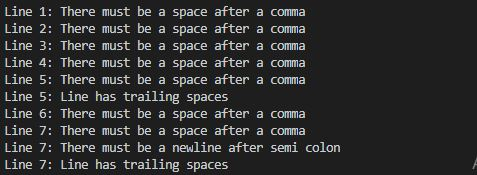
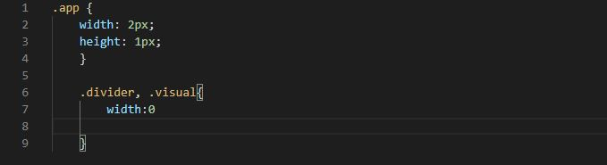

## Ruby-Capstone-Project - CSS Linter
This is a project to build a CSS linter

## Built With
* Ruby
* Rspec
* Colorize
* GitFlow

## Description
This linter detects errors by checking for:

* Check for spaces after comma.
* Check for expected newline after semi-colon.
* Check for empty line in the end of the file.
* Check for unwanted trailing space.
* Check for indentation of 2 spaces.
* Check for unexpected white space before comma.
* Check for zero value who don't need units.

## Screenshots
#Screenshot of the scanning file

# Screenshot of linter displaying errors

## Getting Started
# Prerequisites
  * Terminal / Command Prompt.
  * CSS stylesheets to run the linter.

  ## How to install

  1. Copy the repo link: https://github.com/deikdesign/css-linter.git
  2. Run git clone and paste the link
  3. Install gemfile by writing bundle install in terminal

  ## How to use
  After installing the colorize gem, run the following command.
  bin/main test.css

## Good and Bad Code Examples
# Good Code Example
Here is an example of good practice.
.app {
 width: 2px;
 height: 1px;
 }

# Bad Code Example
 Here is an example of poorly written code.
 .divider, .visual{
     width:0 

 }

## Author
👤 Deyan Todorov
- Github: [@deikdesign](https://github.com/deikdesign)
- Twitter: [@twitterhandle](https://twitter.com/deikdesign)

## 🤝 Contributing
  Contributions, issues and feature requests are welcome!

  Feel free to check the issues page.

## Show your support
  Give a ⭐️ if you like this project!
  

## Acknowledgments
  Hat tip to anyone whose code was used
  Inspiration
  etc

## License
This project is [MIT](lic.url) licensed.